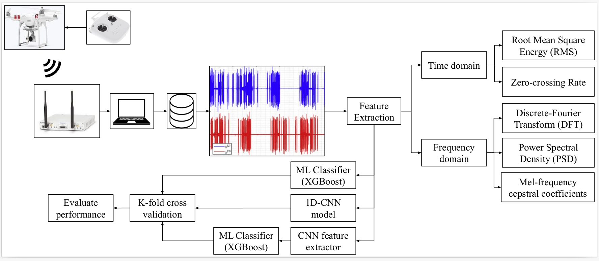

# Machine Learning based framework for Drone Detection and Identification using RF signals

The recent advancement in the state of art technologies for drones and their reduced cost have made them highly accessible to the general public. Though their application is increasing in several domains, they raise security and privacy issues for military bases and civilians. To prevent this, drone detection and identification using RF signals is explored. The dataset considered in this experimental study is DroneRF dataset. Initially, the raw RF data is preprocessed to extract most relevant features using power spectral density technique which are further utilized for training machine learning classifiers such as XGBoost which gave the best accuracy for 2,4 and 10 category. The XGBoost algorithm with PSD features provides 100%, 100%, and 99.73% accuracy for 2, 4 and 10 category based data. To explore the possibility of feature fusion, another experiment was done XGBoost gave 99.13%, 99.11%, and 93.84% accuracy for 2,4 and 10 class problem. To investigate the usage of deep learning techniques, 1DCNN was used which provides 100%, 94.31%, and 86.29% accuracy scores. The final experiment was done using a Hybrid approach where 1DCNN based feature extractor and XGBoost classifier provides 100%, 99.82%, and 99.51% accuracies.

### Flowchart 

*For more details regarding methodology and results, access the paper [here](https://ieeexplore.ieee.org/abstract/document/10068637)*